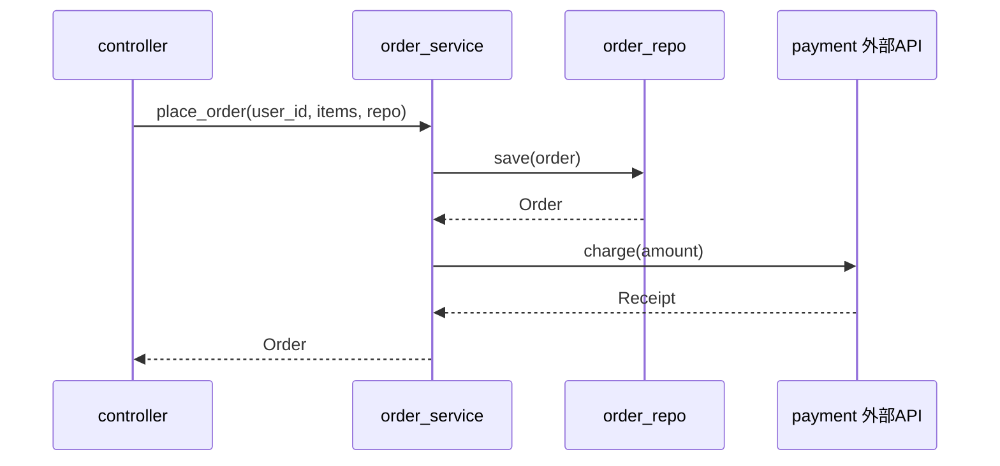
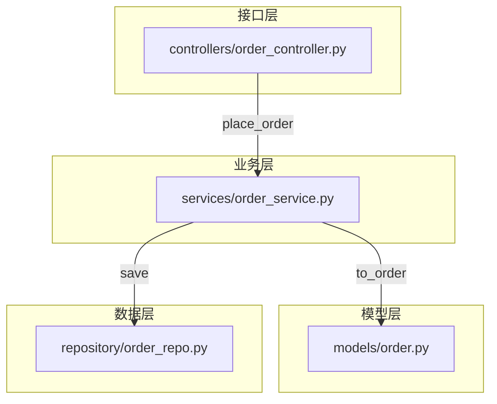

# To-Arch

把已经讨论确定的需求转化为可实施的 **scaffold（架构蓝图）**—— 即将要写哪些文件、每个文件暴露哪些公共接口、切片之间的依赖关系、业务流程如何贯穿各层、测试验证面，全部呈现在 `docs/arch/<项目名>/` 目录中。

> **Leading word**: `scaffold` —— 建造前搭的完整骨架。这里是带类型接口的文件 + Mermaid 时序图/流程图，没有任何实现代码。

> **目标语言为 Python 时**：加载 `python-preferences` skill，按其中的规范生成骨架代码。

## 工作流

### 1. 收集（Gather）

理解用户意图：读取当前对话历史或用户提供的文档。

从上下文或文档内容推断目标语言（Python / TypeScript / Go 等），不确定时询问用户。

**如果是 Python**：显式告知用户将加载 `python-preferences` 来规范骨架代码风格，然后加载该 skill。

**完成条件**：确定了要做什么、用什么语言。

### 2. 切片（Slice）

把计划拆解为**垂直切片（tracer bullet vertical slices）**。每个切片是一条**窄而完整**的路径，贯穿所有集成层（接口层 → 业务层 → 数据层 → 外部依赖），而不是某一层的水平切分。

**切片规则**：
- 每个切片交付一条完整路径，经过每一层
- 完成的切片可独立演示或验证
- 切片之间可能存在依赖关系，列出谁先谁后

为每个切片提供一个简短描述性的名称，并标注它依赖哪些其他切片。

**完成条件**：完成切片清单后，停止并展示给用户。

### 2.5 切片评审（Slice Review）

将上一步确定的切片清单以用户可理解的方式呈现（如表格 + 依赖关系描述），询问用户：
- 每个切片的**颗粒度**是否合适（太粗则一个切片做的事情太多，太细则碎片化）
- 切片之间的**逻辑依赖**是否正确
- 是否有遗漏的切片

根据用户反馈修改切片，直至用户确认。

**完成条件**：用户明确同意当前切片方案，可以进入下一步。

### 3. 蓝图生成（Blueprint）

设计分层文件树，生成骨架源码文件，然后编写 `arch.md` 整合所有视图。

#### 3.1 设计文件树

根据系统架构灵活命名层目录（如 `backend/`、`data/`、`frontend/`、`shared/` 等），不限定为固定目录名。每个文件标注所属切片和职责描述。

**示例输出结构：**
```
docs/arch/<项目名>/
├── arch.md
├── backend/
│   ├── controllers/
│   │   └── order_controller.py
│   ├── services/
│   │   └── order_service.py
│   └── models/
│       └── order.py
├── data/
│   └── repository/
│       └── order_repo.py
└── tests/
    └── test_place_order.py
```

#### 3.2 生成骨架源码文件

在 `docs/arch/<项目名>/` 下的各层目录中写入实际源码文件（接口骨架，无实现体）：

- **函数**：顶层函数 + 完整签名（参数类型、返回类型）+ Google 风格 docstring（中文业务描述 + 英文技术术语），函数体为 `raise NotImplementedError`
- **数据（data）**：函数式编程以数据为核心，定义普通的数据类/ TypedDict / dataclass，不含方法
- **import 路径**：引用 `docs/arch/<项目名>/` 下其他骨架模块
- **文件名与目录名**：遵循目标语言命名规范

**Python 示例**（`docs/arch/<项目名>/backend/services/order_service.py`）：
```python
from backend.models.order import Order
from data.repository.order_repo import OrderRepository


def place_order(
    user_id: int,
    items: list[dict],
    repo: OrderRepository,
) -> Order:
    """下单。

    Args:
        user_id:  用户 ID。
        items:    商品列表，每项包含 product_id 和 quantity。
        repo:     订单仓储。

    Returns:
        创建的订单对象。
    """
    ...
```

#### 3.3 确定测试面

每个切片至少定义一个测试行为，写入 `tests/` 目录下的骨架测试文件。测试函数使用 `assert` 或目标测试框架语法。

#### 3.4 编写 arch.md

在 `docs/arch/<项目名>/arch.md` 中整合以下内容：

1. **概述与技术栈**：系统目的、关键约束、语言/框架
2. **垂直切片表**：Markdown 表格，含切片名、描述、前置依赖
3. **文件结构树**：Markdown 代码块展示完整文件树
4. **每个切片的 Mermaid 时序图**：展示该切片业务流程如何贯穿各层（接口层→业务层→数据层→外部依赖）
5. **Mermaid Flowchart（带子图）**：一张总图展示所有模块/文件之间的依赖关系，用 `subgraph` 按层分组

**时序图画法规范**（每个切片一张）：



- `participant` 按架构层命名，体现请求的端到端路径
- 箭头方向始终从调用方到被调用方，返回用虚线
- 每个时序图专注一个切片的核心流程，不要混杂多个切片

**Flowchart 画法规范**（一张总图）：



- 用 `subgraph` 按架构层分组，每层一个子图
- 节点标签用 `文件路径["显示名"]` 格式
- 连线上标注关键方法调用
- 方向建议 `TB`或 `LR`，根据复杂度选择

#### 3.5 arch.md 模板骨架

```markdown
# {项目名} 架构蓝图

## 概述

{系统目的、关键约束、技术栈}

## 垂直切片

| 切片 | 描述 | 前置依赖 |
|------|------|----------|
| {切片名} | {一句话描述} | {无/切片名} |

## 文件结构

```
{docs/arch/<项目名>/ 下的文件树}
```

## 业务流程（时序图）

### 切片：{切片名}

```mermaid
sequenceDiagram
    ...
```

{每个切片重复}

## 模块依赖关系

```mermaid
flowchart TB
    subgraph ...
    ...
```
```

## 完成

告知用户蓝图已就绪及 `docs/arch/<项目名>/` 目录路径。
